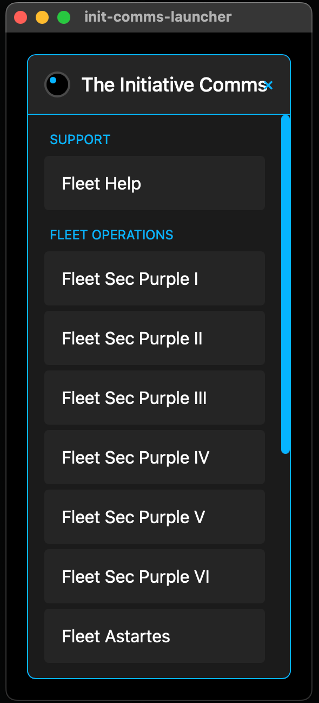

# init-comms-launcher

**init-comms-launcher** is a desktop application built with [Tauri](https://tauri.app/). It displays a custom HTML/CSS interface for managing and launching external links (for example, Mumble links). This repository contains the complete source code and configuration for building, packaging, and deploying the application on macOS.



## Table of Contents

* [Overview](#overview)
* [Features](#features)
* [Prerequisites](#prerequisites)
* [Dependencies](#dependencies)
* [Installation](#installation)
* [Development](#development)
* [Building and Packaging](#building-and-packaging)
* [Configuration](#configuration)
* [Deployment](#deployment)
* [Troubleshooting](#troubleshooting)
* [Contributing](#contributing)
* [Changelog](#changelog)
* [License](#license)

## Overview

**init-comms-launcher** is designed to provide a native desktop interface for launching external applications via custom protocol links. The application is built using Tauri, which allows you to create lightweight desktop applications using web technologies (HTML, CSS, and JavaScript) while leveraging Rust for performance-critical parts.

## Features

* **Native Desktop Application:** Utilizes Tauri for building small, fast, and secure desktop applications
* **Custom User Interface:** Fully customizable HTML/CSS interface with a draggable window
* **External Link Handling:** Launch external applications (e.g., Mumble) using custom protocol links
* **Highlight Active Channel:** The last clicked channel is visually highlighted to keep it in focus
* **Configurable Channels:** Load channels dynamically from a JSON configuration file (`channels.json`)
* **Packaging:** Easily package the application for macOS into distributable formats (e.g., .dmg, executable)

## Prerequisites

Before building and running the application, ensure you have installed:

* **[Node.js](https://nodejs.org/)** (LTS version recommended)
* **[Rust](https://www.rust-lang.org/tools/install)** (including Cargo)
* **[Tauri CLI](https://tauri.app/v1/guides/getting-started/installation)**
    * Install globally via npm:
      ```bash
      npm install -g @tauri-apps/cli
      ```

## Dependencies

Here's the complete `package.json` configuration:

```json
{
  "name": "init-comms-launcher",
  "private": true,
  "version": "1.2.0",
  "type": "module",
  "scripts": {
    "dev": "vite",
    "build": "tsc && vite build",
    "preview": "vite preview",
    "tauri": "tauri"
  },
  "dependencies": {
    "@tauri-apps/api": "^2.2.0",
    "@tauri-apps/plugin-fs": "^2.2.0",
    "@tauri-apps/plugin-opener": "^2"
  },
  "devDependencies": {
    "@tauri-apps/cli": "^2",
    "typescript": "~5.6.2",
    "vite": "^6.0.3"
  }
}
```

Install all dependencies by running:

```bash
npm install
```

## Installation

1. Clone the Repository:
    ```bash
    git clone git@github.com:cchopin/init-comms-launcher.git
    cd init-comms-launcher
    ```

2. Install Node.js Dependencies:
    ```bash
    npm install
    ```

## Development

To run the application in development mode:

1. Start the Development Server:
    ```bash
    npm run tauri -- dev
    ```

2. Live Reloading:
    * Any changes to the front-end (HTML, CSS, JavaScript) will trigger a live reload
    * Changes to the Rust code will require a restart of the Tauri process

## Building and Packaging

To build a production version and package the application for macOS:

1. Build the Front-end Assets:
    ```bash
    npm run build
    ```

2. Package the Tauri Application:
    ```bash
    npm run tauri build
    ```

3. Locate the Packaged Application:
    * After the build completes, find the packaged application (for example, a .dmg installer) in:
      ```
      src-tauri/target/release/bundle
      ```

## Configuration

### Tauri Configuration

The Tauri configuration file is located at `src-tauri/tauri.conf.json`. You can customize various aspects of your application here:

```json
{
  "$schema": "https://schema.tauri.app/config/2",
  "productName": "init-comms-launcher",
  "version": "0.1.0",
  "identifier": "com.init-comms-launcher.app",
  "build": {
    "beforeDevCommand": "npm run dev",
    "devUrl": "http://localhost:1420",
    "beforeBuildCommand": "npm run build",
    "frontendDist": "../dist"
  },
  "app": {
    "withGlobalTauri": true,
    "windows": [
      {
        "title": "init-comms-launcher",
        "width": 400,
        "height": 800,
        "transparent": false,
        "backgroundColor": "#FF000000"
      }
    ],
    "security": {
      "csp": null
    }
  },
  "bundle": {
    "active": true,
    "targets": "all",
    "icon": [
      "icons/32x32.png",
      "icons/128x128.png",
      "icons/128x128@2x.png",
      "icons/icon.icns",
      "icons/icon.ico"
    ]
  }
}
```

### Front-end Customization

* **Channels Configuration:** The `channels.json` file, located at the root of the application, contains the list of channel categories and their associated links.
* **User Interface:** Your HTML/CSS files (such as `index.html`) define the appearance of the application interface.

## Deployment

After packaging the application, you can distribute the generated installer or executable to your macOS users. Detailed instructions on deployment and additional configuration options are available in the Tauri documentation.

## Troubleshooting

* **API Issues:** Ensure that you run the application using `npm run tauri -- dev` so that the Tauri API is available
* **Build Errors:** Verify that your Node.js and Rust environments are correctly configured
* **Window Appearance:** If the window background or dimensions do not appear as expected, check the settings in `tauri.conf.json`

## Contributing

Contributions are welcome! If you have suggestions for improvements or encounter any issues, please open an issue or submit a pull request.

## Changelog

### [1.2.0] - 2025-02-14
#### Added:
* Highlighting for the last clicked channel
* Configurable channels list loaded from a JSON file (`channels.json`)

### [1.1.1] - 2025-02-12
#### Fixed:
* Corrected URL encoding for Mumble links (replaced [ and ] with %5B and %5D)
* Properly scoped the status variable in OS-specific blocks for Windows and macOS

## License

This project is licensed under the MIT License.